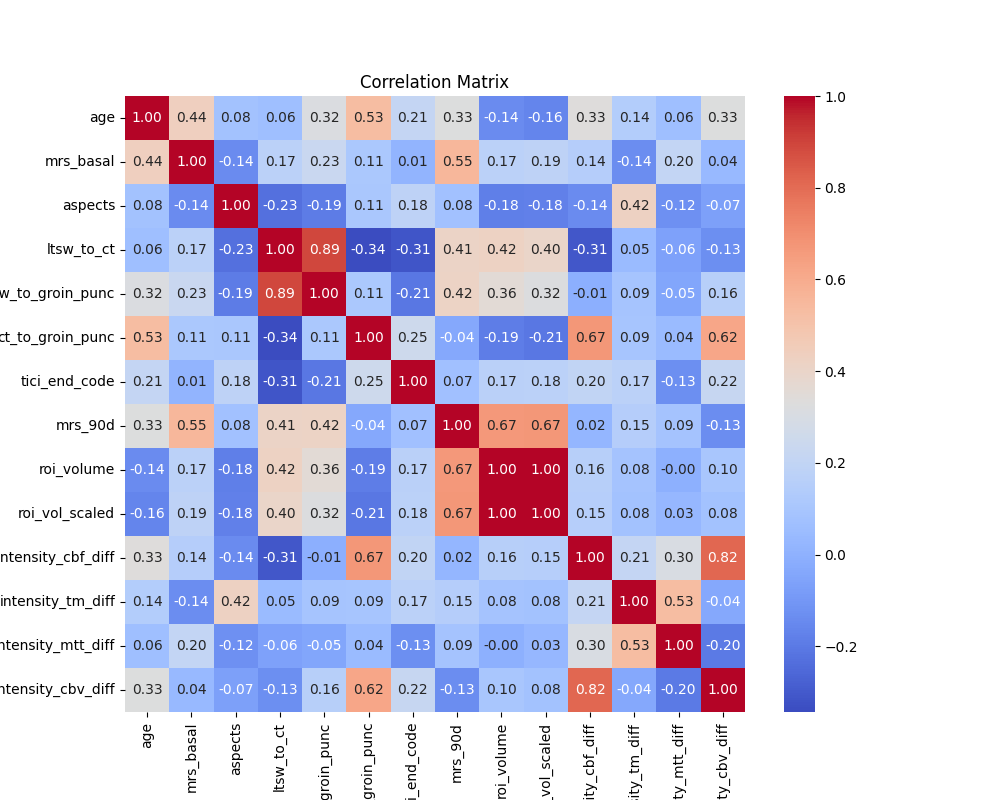
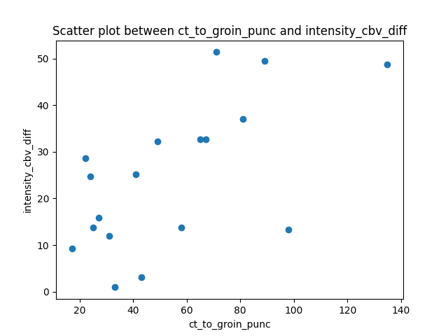
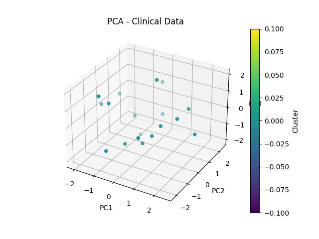
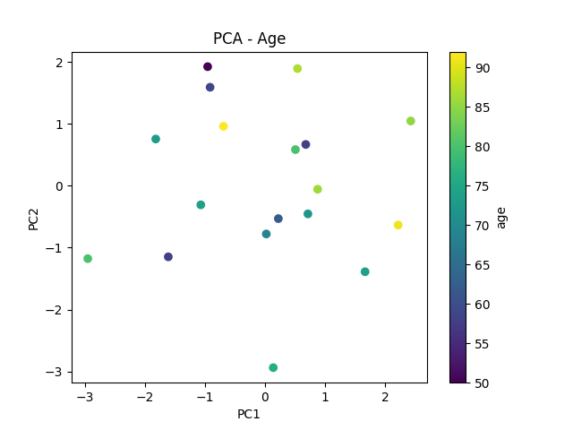

# Clinical data

## Table of Contents
- [Abstract](#abstract)
- [How to Use](#how-to-use)
- [The Code Structure](#the-code-structure)
- [Results](#results)

## Abstract

This project is an independent part of a bigger project which aims to find a perfusion parameters combination that will improve the definition of the ischemic core. This part performs a clinical data analysis using Principal Component Analysis (PCA) and DBSCAN clustering to identify patterns in patient data. The analysis integrates various clinical parameters, including infarct ROI volumes, perfusion parameters medians, and demographic data, to explore potential relationships and cluster patients based on key features. The workflow includes data preprocessing, correlation analysis, dimensionality reduction, clustering, and visualization of results.


## How to Use

1. **Download and Installation:**

To use this project, follow these steps:

1.	Clone the repository
```sh
git clone https://github.com/GiacomoRapparini2/Clinical_data.git
cd your-repository-name
```


2.	Create and activate a virtual environment (optional but recommended)
```sh
python -m venv venv
source venv/bin/activate  # On macOS/Linux
venv\Scripts\activate  # On Windows
```


3.	Install dependencies
Use this command to install the required libraries to run the code:
```sh
pip install -r requirements.txt
```


4.	Ensure that all necessary data files are available, including:
    - paths.json (to specify data locations)
    - clinical_data.csv (clinical dataset containing the clinical features for all patients)
    - roi_volumes_scaled.csv (containing the volumes of the infarct core ROIs rescaled considering the brain)
    - median_results.csv (containing the median values of each perfusion parameter for each region and for all patients)


5.  Execution:

To run the analysis, simply execute the clinical_data.py script:
```sh
python clinical_data.py
```

This will:
    - Load and preprocess clinical data
    - Perform correlation analysis and save results
    - Apply PCA to obtain dimensionality reduction
    - Cluster patients using DBSCAN
    - Generate and save visualizations


## The Code Structure

The code is organized into the following components:

- **`clinical_data.py`:** The main script.
- **`functions.py`:** Contains all the functions that are used by `clinical_data.py`.
- **`test_functions.py`:** Contains the tests for the functions present in `functions.py`.

To run the tests, use the command:
```sh
python -m unittest test_functions.py
```
- **`paths.json/`:** A json file with the paths to the folder containing the clinical data and the folder containing the results that will be stored.

## Results

Here are some examples of possible results from this project:




